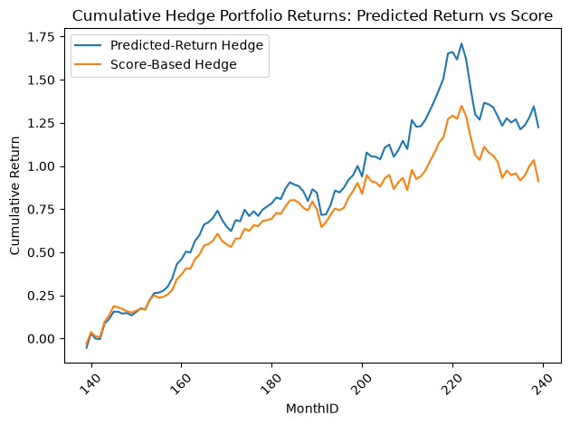

# CFM 301 – Portfolio Factor Strategy Backtesting

Group project for **Financial Data Analytics** (Prof. Huang, University of Waterloo).
The project designs, backtests, and evaluates a cross-sectional equity "factor" strategy —
the same broad approach used by quant funds to systematically pick stocks — on a universe
of S&P 1500 stocks, following the course's Quantitative Trading Strategy guidelines.

## What is this project, in plain terms?

The core idea behind "factor investing" is that certain measurable characteristics of a
stock (how cheap it is relative to its book value, how much its sales are growing, how
volatile its cash flows are, its recent price momentum, etc.) have historically been
associated with higher or lower future returns. A factor strategy tries to systematically
buy stocks that look attractive on these characteristics and avoid or short-sell stocks
that look unattractive.

This project builds such a strategy from scratch and tests it honestly:
1. **Train** the model on the older two-thirds of the data (1986–2011) to see which
   characteristics ("factors") actually predicted next-month returns during that period.
2. **Lock in** a final set of factors based on that training evidence.
3. **Test** the resulting strategy on data it never saw (2011–2019) to check whether the
   patterns discovered in training actually held up going forward — this is the crucial
   "out-of-sample" step that separates a genuinely useful strategy from one that's just
   curve-fit to history.

This train/test split matters because it's very easy to find factors that "worked" by
coincidence in a fixed historical sample; the only real test of a strategy is whether it
keeps working on data it hasn't seen yet.

## Objective

Build and backtest a multi-factor stock-selection model that:
1. Screens a universe of liquid U.S. equities (so the strategy isn't built on stocks that
   are too small or illiquid to actually trade).
2. Estimates factor premia in-sample using monthly Fama-MacBeth cross-sectional regressions
   — a standard finance-research method for measuring how much return a characteristic is
   associated with, month by month.
3. Selects a final set of factors based on statistical significance (and judgment).
4. Scores and ranks stocks out-of-sample, forms long/short decile portfolios, and evaluates
   whether the resulting "hedge portfolio" actually made money on unseen data.

## Data

- **`merged_df.sas7bdat`** – base panel of S&P 1500 stocks (permno, ticker, price, shares
  outstanding, returns) plus forward 1- to 12-month returns, 1980–2019.
- **WRDS factor/signal files** – individual factor series merged onto the base panel by
  `permno` and month, including:
  - `momentum12` (12-month price momentum)
  - `ITOA`, `AccrualVol`, `AbsAccrual`, `CFVol` (accruals/cash-flow quality)
  - `DIV_P`, `RD_P`, `EP`, `BM`, `EV_EBITDA` (valuation/yield ratios)
  - `beta`, `CASHPROD`, `FCF`, `SG`, `momaccel`, `sue_NI`, `Cto`, `tail_2y`, `dp`,
    `aftret_invcapx`
- **`variableDefinitions.xlsx`** – factor/variable definitions (reference only, not loaded
  in code).

Data files are not included in this repo (course-restricted WRDS/Learn data); the notebook
expects them in the working directory (see "How to run" below).

## Methodology

The notebook follows the assignment's numbered steps:

1. **Liquidity screen** – at the start of each calendar year, a stock is flagged `isLiquid`
   only if price > \$5 and market cap ≥ \$100M, so the strategy is only ever "trading"
   stocks that would be realistically tradable.
2. **Factor construction** – WRDS factor and financial-ratio tables are merged onto the base
   panel by `permno`/month; a 12-month-minus-1-month momentum factor is derived from raw
   momentum and lagged returns (a standard adjustment to avoid short-term return reversal
   contaminating the momentum signal).
3. **Data filtering** – rows with missing values are dropped, and each factor is winsorized
   at the 1st/99th percentile within each month (then converted to a monthly z-score) so
   that a handful of extreme outlier values can't dominate the regressions. The dependent
   variable (forward return) is deliberately left unstandardized, per the assignment.
4. **In-sample estimation (training set)** – monthly cross-sectional OLS regressions of
   1-month-forward return on the winsorized/z-scored factors (Fama-MacBeth), using the
   first ~3/4 of the sample period (months 1–138, ≈1986–2011) as the training window. Each
   month's regression produces a set of factor "premia" (coefficients); averaging those
   premia across all 307 training months, and computing a t-stat for that average, tells us
   how reliably each factor predicted next-month returns.
5. **Factor selection** – factors are kept if the in-sample average Fama-MacBeth t-statistic
   exceeds a threshold (|t| ≥ 1.5). Of the 14 factors that cleared this bar, four were
   manually dropped after discussion (`DIV_P`, `AbsAccrual`, `EV_EBITDA`, `RD_P`), leaving a
   final model of **10 factors**, and the model was re-estimated on the remaining set.
6. **Out-of-sample scoring** – for the held-out period (months 139–239, ≈2011–2019), each
   stock is scored two different ways each month, using only information the model
   "learned" during training:
   - **Predicted return**: intercept + Σ(factor premia × factor z-score)
   - **T-stat-weighted score**: Σ(factor t-stat × factor z-score) — this weights each
     factor by how reliable it was in training, not just by its raw predicted effect.
7. **Portfolio formation** – each month, stocks are sorted into deciles by each score; a
   long-top-decile / short-bottom-decile equal-weighted "hedge portfolio" is built for both
   scoring methods, with a t-test comparing the top decile's returns to the bottom decile's.
   This hedge portfolio simulates what an investor would have earned by going long the
   stocks the model liked best and short the stocks it liked least.
8. **Performance comparison** – cumulative returns of the predicted-return hedge portfolio
   and the t-stat-score hedge portfolio are plotted against each other over the
   out-of-sample period to see how the strategy would have actually performed.

## Results

**Training sample:** months 1–138 (306 monthly cross-sections, ≈1986–2011).
**Out-of-sample test:** months 139–239 (101 months, ≈2011–2019), 104,632 stock-month
observations.

Final 10 factors kept, with their in-sample Fama-MacBeth average monthly premia and t-stats:

| Factor | Avg. premia | t-stat |
|---|---:|---:|
| BM (book-to-market) | 0.0029 | 4.62 |
| FCF (free cash flow) | 0.0017 | 4.43 |
| tail_2y | 0.0018 | 3.77 |
| SG (sales growth) | 0.0013 | 3.60 |
| CFVol (cash-flow volatility) | -0.0020 | -2.93 |
| EP (earnings-to-price) | -0.0017 | -2.51 |
| Cto (capital turnover) | 0.0012 | 2.47 |
| momentum12_1 | 0.0013 | 1.49 |
| dp (dividend-to-price) | -0.0007 | -1.05 |
| sue_NI (earnings surprise) | 0.0005 | 1.39 |
| *const (intercept/alpha)* | 0.0157 | 5.33 |

These t-stats say that, **in training**, factors like book-to-market, free cash flow, and
sales growth were fairly reliable predictors of next-month returns (t-stats well above the
conventional "significant" threshold of ~2), while a few kept factors (momentum, dividend
yield, earnings surprise) were weaker but still cleared the project's judgment-based bar.

Out-of-sample, the top-decile-minus-bottom-decile hedge portfolio was **not statistically
significant** for either scoring method over the 101-month test window:
- Predicted-return hedge: long vs. short t-stat = 1.25 (p = 0.21)
- T-stat-weighted score hedge: long vs. short t-stat = 1.04 (p = 0.30)

Despite the insignificant t-tests, the cumulative return chart below shows both hedge
portfolios trending positive over the out-of-sample period, with the predicted-return
method (blue) outperforming the t-stat-weighted score method (orange) for most of the
window before both give back gains toward the end of the sample:

The predicted-return hedge portfolio peaks at roughly +170% cumulative return around
month 220 before pulling back to around +130% by the end of the sample; the score-based
hedge portfolio follows a similar but more muted path, peaking near +130% and ending
closer to +90–100%.

## Why these results matter (and why they don't fully settle the question)

The headline tension in this project is: **the strategy's factors looked statistically
strong in training, but the resulting long/short portfolio wasn't statistically significant
out-of-sample.** That gap is itself the main finding, and it's a common and important
result in quantitative finance for a few reasons:

- **In-sample significance can overstate real predictive power.** A t-stat computed over
  the same data used to pick the factors is naturally more favorable than what the same
  factors will achieve going forward — some of what looked like a real signal in training
  was likely just training-period noise.
- **A positive-looking chart isn't the same as a statistically reliable one.** The
  cumulative return chart shows the hedge portfolio ending up meaningfully positive, which
  looks encouraging — but with only 101 monthly observations and a t-stat around 1.0–1.25,
  that upward drift is consistent with a real (if weak) edge, but is also well within the
  range you'd expect from luck alone. The point estimate and the statistical test are
  telling two different parts of the same story, and both are needed to interpret the
  strategy honestly.
- **This is exactly the kind of check the project was designed to force.** The whole point
  of the in-sample/out-of-sample split (rather than just reporting how well the model fits
  its own training data) is to simulate what would happen if you actually traded the
  strategy going forward. A strategy that "looks great" only in-sample but doesn't hold up
  out-of-sample would have lost an investor money (or at least failed to deliver on its
  promise) in real life — so an insignificant out-of-sample result is a genuinely
  informative (if underwhelming) outcome, not a failure of the analysis.
- **It suggests next steps rather than a dead end.** A natural continuation would be to
  test the decile portfolios' Sharpe ratio, CAPM alpha, and Fama-French 3-factor alpha (as
  the assignment suggests) to see if the strategy earned risk-adjusted excess return even
  without a "significant" long/short spread, and to check whether performance was
  concentrated in a subset of the out-of-sample period rather than spread evenly across it.

## Files

| File | Description |
|---|---|
| `CFM_Final_Group_Project_Code.ipynb` | Full analysis notebook (data loading, factor construction, Fama-MacBeth estimation, portfolio backtest) |
| `financialdataanlytics_project.pdf` | Original assignment/guidelines from the instructor |
| `cumulative_hedge_returns.png` | Out-of-sample cumulative return chart for both hedge portfolio methods |
| Project report (submitted separately) | Write-up covering factor rationale, in-sample/out-of-sample results, and conclusions |

## How to run

1. Open the notebook locally (Jupyter/VS Code) or in Colab. The first cell auto-installs any
   missing dependencies (`numpy`, `pandas`, `scikit-learn`, `matplotlib`, `pandasql`,
   `statsmodels`, `scipy`).
2. Place `merged_df.sas7bdat` and the WRDS factor `.sas7bdat` files in the working directory
   (or update the file paths in the data-loading cells).
3. Run cells sequentially:
   - Data loading & liquidity screen
   - Factor merge & construction
   - Winsorization/z-scoring
   - Fama-MacBeth training regression → factor selection → retraining
   - Out-of-sample scoring & decile portfolio construction
   - Hedge portfolio return and cumulative performance plot

## Notes / limitations

- Requires WRDS-licensed data not included in this repository.
- Both long/short decile hedge portfolios were statistically insignificant out-of-sample
  (p > 0.2), despite several factors showing strong in-sample significance — a reminder
  that in-sample factor significance doesn't guarantee out-of-sample profitability.
- The full performance-analytics suite suggested by the assignment (Sharpe ratio, CAPM
  alpha, Fama-French 3-factor alpha, information ratio) is not yet computed in the current
  notebook version — only raw hedge-portfolio returns, the long/short t-tests, and
  cumulative return plots are produced. See the project report for any additional reported
  figures.
